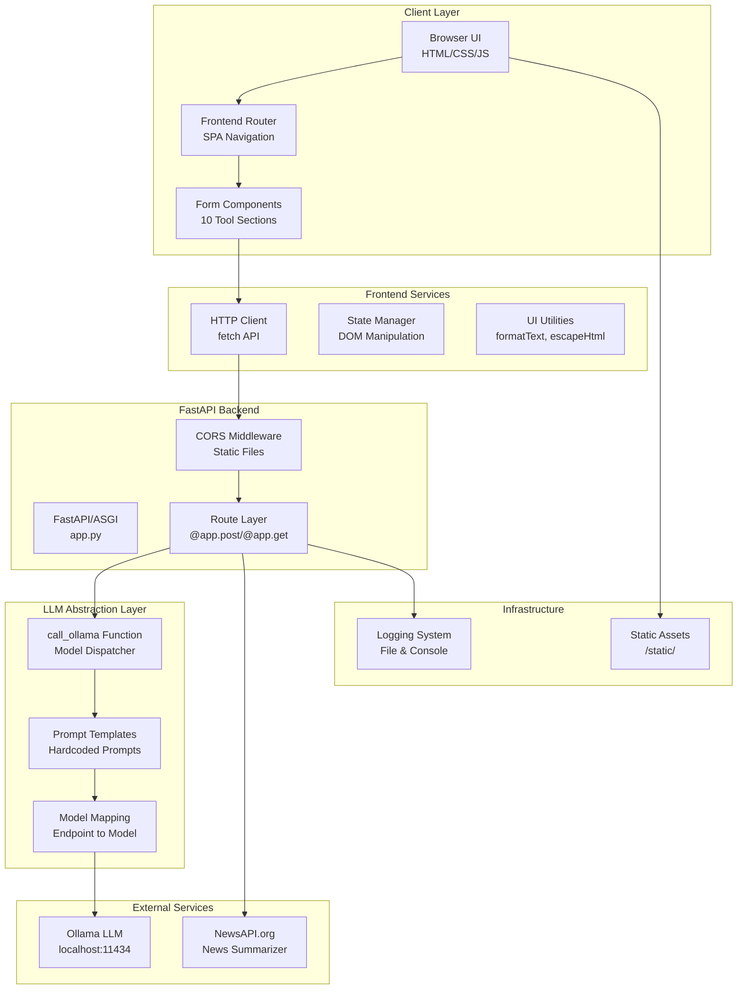
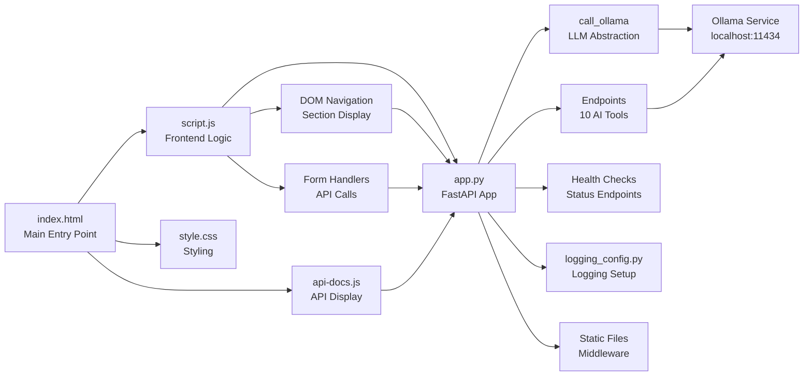

# PROJECT ANALYSIS: AI Delivery Operating System Transformation
**Principal Software Architect Review**  
**Date**: 2026-07-06  
**Status**: Pre-Implementation Architecture Analysis

---

## EXECUTIVE SUMMARY

This document provides a comprehensive architectural analysis of the current **Consolidated AI Portal** codebase before transformation to the **MultiAgent AI Delivery Operating System**. The application is well-structured with clean separation of concerns, reusable patterns, and clear LLM abstraction layers. **Minimal breaking changes required** for the transformation—primarily navigation/routing updates with preserved backend architecture.

**Current State**: 10 AI tools (General Purpose)  
**Target State**: 16 Delivery-Specific Agents (Delivery Operating System)  
**Transformation Scope**: Navigation, Icons, Routing, Prompt Customization ✓ | Backend Architecture: Preserve ✓

---

## 1. ARCHITECTURE OVERVIEW

### 1.1 System Architecture Diagram



### 1.2 Component Dependency Graph



---

## 2. CURRENT PROJECT STRUCTURE

```
Consolidated_Portal/
├── app.py                          # FastAPI application (380 lines)
├── requirements.txt                # Dependencies
├── logging_config.py              # Logging configuration
├── test_portals.py                # Integration tests
├── test_logging.py                # Logging tests
├── monitor_logs.py                # Log monitoring tool
├── startup.sh                     # Startup script
├── Procfile                       # Production deployment config
├── static/
│   ├── index.html                 # Main UI (250+ lines)
│   ├── script.js                  # Frontend logic (200+ lines)
│   ├── style.css                  # Styling (300+ lines)
│   └── api-docs.js                # API documentation (80 lines)
├── logs/
│   └── app_YYYYMMDD_HHMMSS.log    # Application logs
└── venv/                          # Python virtual environment
```

---

## 3. SIDEBAR NAVIGATION ARCHITECTURE

### 3.1 Current Sidebar Structure (Controls: index.html)

**File**: `static/index.html` (lines 18-29)

```html
<ul class="nav-links">
    <li data-target="code-assistant">Code Assistant</li>
    <li data-target="content-writer">Content Writer</li>
    <li data-target="legal-analyzer">Legal Analyzer</li>
    <li data-target="news-summarizer">News Summarizer</li>
    <li data-target="proofreader">Proofreader</li>
    <li data-target="text-summarizer">Text Summarizer</li>
    <li data-target="virtual-assistant">Virtual Assistant</li>
    <li data-target="customer-support">Customer Support</li>
    <li data-target="ecom-recommender">Shop Recommender</li>
    <li data-target="symptom-checker">Symptom Checker</li>
    <li data-target="api-docs">API Documentation</li>
</ul>
```

### 3.2 Sidebar Control Flow

```
User Clicks Nav Item
    ↓
event.target = <li data-target="xyz">
    ↓
script.js Line 17: navLinks.addEventListener('click', ...)
    ↓
Get targetId from data-target attribute
    ↓
Find matching <section id="xyz" class="tool-section">
    ↓
Set .active-section CSS class
    ↓
Display corresponding form
    ↓
Update page title from nav link text
```

### 3.3 Icon System

**Source**: FontAwesome 6.4.0 CDN  
**Current Icons**: `<i class="fa-solid fa-[icon-name]"></i>`

| Current Tool | Icon | Current Icon Class |
|--------------|------|-------------------|
| Code Assistant | 💻 | fa-code |
| Content Writer | ✍️ | fa-pen-nib |
| Legal Analyzer | ⚖️ | fa-scale-balanced |
| News Summarizer | 📰 | fa-newspaper |
| Proofreader | 📝 | fa-spell-check |
| Text Summarizer | 📉 | fa-compress |
| Virtual Assistant | 🤖 | fa-robot |
| Customer Support | 🎧 | fa-headset |
| Shop Recommender | 🛒 | fa-cart-shopping |
| Symptom Checker | 💉 | fa-stethoscope |

---

## 4. ROUTING ARCHITECTURE

### 4.1 Frontend Routing (script.js)

**Type**: Client-Side SPA Routing (No History API)  
**Method**: Data Attributes + CSS Classes  
**Location**: `static/script.js` lines 11-45

```javascript
// Navigation Click Handler
navLinks.forEach(link => {
    link.addEventListener('click', () => {
        // 1. Update Active Link
        navLinks.forEach(l => l.classList.remove('active'));
        link.classList.add('active');
        
        // 2. Update Page Title
        pageTitle.textContent = link.querySelector('span').textContent.trim();
        
        // 3. Show Relevant Section
        const targetId = link.getAttribute('data-target');
        toolSections.forEach(section => {
            if (section.id === targetId) {
                section.classList.add('active-section');
            } else {
                section.classList.remove('active-section');
            }
        });
    });
});
```

### 4.2 Backend Routing (app.py)

**Type**: FastAPI REST Routes  
**Location**: `app.py` lines 75-320

| Endpoint | Method | Input | Model | Output |
|----------|--------|-------|-------|--------|
| `/api/generate_code` | POST | prompt, mode | qwen2.5-coder:7b | {response} |
| `/api/generate_content` | POST | topic, style | gemma4:latest | {response} |
| `/api/analyze_legal_text` | POST | text | phi3:14b | {response} |
| `/api/fetch_and_summarize_news` | GET | category | qwen3.6:27b | {summary, articles} |
| `/api/proofread` | POST | text | DeepSeek-R1:latest | {response} |
| `/api/summarize` | POST | text | mistral:7b | {response} |
| `/api/virtual_assistant` | POST | user_query | gemma4:latest | {response} |
| `/api/customer_support` | POST | user_query | qwen3.6:27b | {response} |
| `/api/ecommerce_recommender` | POST | preferences | granite4.1:8b | {response} |
| `/api/medical_symptom_checker` | POST | symptoms | phi3:14b | {response} |
| `/api/endpoints` | GET | - | - | {total_endpoints, endpoints[]} |
| `/api/health` | GET | - | - | {status, timestamp} |
| `/api/default` | GET | - | - | {message, version, status} |
| `/api/ollama-status` | GET | - | - | {available, models_count, models} |
| `/api/logs` | GET | lines | - | {log_file, total_lines, logs} |

### 4.3 Form-to-API Mapping (script.js)

**Location**: Lines 145-155

```javascript
// Form Event Listeners → API Endpoints
document.getElementById('form-code').addEventListener('submit', 
    (e) => handleFormSubmit(e, 'generate_code'));
document.getElementById('form-content').addEventListener('submit', 
    (e) => handleFormSubmit(e, 'generate_content'));
// ... 8 more form handlers
```

---

## 5. AI MODULE CREATION PATTERN

### 5.1 How AI Modules Are Created

**Pattern**: Hardcoded endpoint definitions in `app.py`

**Step-by-Step Module Creation**:

1. **Define Endpoint** (app.py, lines 200-210)
```python
@app.post("/api/endpoint_name")
def endpoint_name(input_param: str = Form(...)):
    prompt = f"Instruction template with {input_param}"
    return call_ollama("model_name", prompt)
```

2. **Register in Metadata** (app.py, lines 75-170)
```python
endpoints = [
    {
        "id": N,
        "name": "Display Name",
        "endpoint": "/api/endpoint_name",
        "method": "POST",
        "model": "model_name",
        "description": "What it does",
        "params": {"input_param": "description"}
    }
]
```

3. **Create HTML Form** (index.html, lines 120-135)
```html
<section id="section-id" class="tool-section">
    <form id="form-id">
        <input name="input_param" />
        <button type="submit">Button Text</button>
    </form>
</section>
```

4. **Register Form Handler** (script.js, lines 145-155)
```javascript
document.getElementById('form-id').addEventListener('submit', 
    (e) => handleFormSubmit(e, 'endpoint_name'));
```

5. **Update Sidebar** (index.html, lines 24)
```html
<li data-target="section-id"><i class="fa-solid fa-icon"></i> Display Name</li>
```

### 5.2 Current LLM Models Used

| Model | Provider | Use Case | Count |
|-------|----------|----------|-------|
| qwen2.5-coder:7b | Ollama | Code generation/debugging | 1 |
| gemma4:latest | Ollama | Content writing, Virtual Assistant | 2 |
| phi3:14b | Ollama | Legal analysis, Symptom checking | 2 |
| qwen3.6:27b | Ollama | News summarization, Customer support | 2 |
| DeepSeek-R1:latest | Ollama | Proofreading | 1 |
| mistral:7b | Ollama | Text summarization | 1 |
| granite4.1:8b | Ollama | eCommerce recommendations | 1 |

**Total Unique Models**: 7  
**All Ollama-based**: ✓ (localhost:11434)

---

## 6. LLM SERVICE INVOCATION

### 6.1 The `call_ollama` Function (App.py, lines 310-335)

**Central LLM Abstraction Point**:

```python
def call_ollama(model_name: str, prompt: str):
    headers = {"Content-Type": "application/json"}
    try:
        response = requests.post(
            OLLAMA_URL,  # http://localhost:11434/api/generate
            json={"model": model_name, "prompt": prompt, "stream": False},
            headers=headers,
            timeout=300  # 5 min timeout
        )
        response_data = response.text.strip()
        json_response = json.loads(response_data)
        return {"response": json_response.get("response", "No valid response.")}
    except requests.exceptions.Timeout:
        raise HTTPException(status_code=503, detail="Ollama timeout")
    except requests.exceptions.ConnectionError:
        raise HTTPException(status_code=503, detail="Cannot connect to Ollama")
```

### 6.2 LLM Invocation Flow

```
Frontend Form Submit
    ↓
POST /api/endpoint_name
    ↓
app.py: @app.post("/api/endpoint_name")
    ↓
Create prompt from user input
    ↓
call_ollama(model_name, prompt)
    ↓
requests.post(OLLAMA_URL, json={model, prompt})
    ↓
Wait for response (timeout: 300s)
    ↓
Parse JSON response
    ↓
Extract response field
    ↓
Return {"response": response_text}
    ↓
Frontend: Receive response
    ↓
Display in response card
```

### 6.3 Error Handling

| Error Type | Handler | HTTP Code | Message |
|-----------|---------|-----------|---------|
| Connection Error | ConnectionError | 503 | Cannot connect to Ollama |
| Timeout | Timeout | 503 | Ollama is not responding |
| Invalid JSON | JSONDecodeError | 500 | Invalid JSON response |
| Request Error | RequestException | 503 | Ollama request failed |

---

## 7. PROMPT MANAGEMENT

### 7.1 Current Prompt Architecture

**Type**: Hardcoded inline prompts in endpoint functions  
**Location**: `app.py`, lines 195-310  
**Pattern**: Template strings with user input interpolation

### 7.2 Prompt Examples

**Code Assistant** (lines 203-210):
```python
if mode == "generate":
    full_prompt = f"Write a clean, well-documented {prompt} code snippet."
elif mode == "debug":
    full_prompt = f"Debug and fix the following code:\n{prompt}"
```

**Content Writer** (lines 213-215):
```python
prompt = f"Write a detailed blog post about '{topic}' in a {style} tone."
```

**Legal Analyzer** (lines 218-220):
```python
prompt = f"Extract key insights from the following legal document:\n{text}\nSummarize important clauses, risks, and obligations."
```

**Customer Support** (lines 272-275):
```python
prompt = f"You are a customer support chatbot. Answer the user's question professionally and concisely.\nUser: {user_query}\nChatbot:"
```

### 7.3 Prompt Template Pattern

All prompts follow this pattern:
```
[System Role/Context] + [User Input] + [Optional Instructions]
```

Examples:
- "Write a clean, well-documented **{user_input}** code snippet."
- "Extract key insights from: **{user_input}**\nSummarize..."
- "You are **{role_definition}**.\n**{user_query}**\n**{role_name}**:"

---

## 8. REUSABLE COMPONENTS

### 8.1 Frontend Components

| Component | File | Location | Reusability | Purpose |
|-----------|------|----------|------------|---------|
| **Navigation Handler** | script.js | Lines 11-45 | ⭐⭐⭐⭐⭐ | Generic nav click handler |
| **Form Submission Handler** | script.js | Lines 48-150 | ⭐⭐⭐⭐⭐ | Universal form processor |
| **Response Formatter** | script.js | Lines 152-175 | ⭐⭐⭐⭐ | Format various response types |
| **API Client** | script.js | Lines 55-75 | ⭐⭐⭐⭐⭐ | Generic fetch wrapper |
| **Status Checker** | script.js | Lines 180-190 | ⭐⭐⭐ | Ollama status monitor |
| **Sidebar Template** | index.html | Lines 18-29 | ⭐⭐⭐⭐⭐ | Data-driven nav list |
| **Tool Section Template** | index.html | Lines 55-95 | ⭐⭐⭐⭐⭐ | Form container template |
| **Response Card** | index.html | Lines 210-220 | ⭐⭐⭐⭐ | Output display area |

### 8.2 Backend Components

| Component | File | Location | Reusability | Purpose |
|-----------|------|----------|------------|---------|
| **LLM Abstraction** | app.py | Lines 310-335 | ⭐⭐⭐⭐⭐ | Model dispatcher |
| **Endpoint Metadata** | app.py | Lines 75-170 | ⭐⭐⭐⭐⭐ | Dynamic endpoint registry |
| **Error Handler** | app.py | Lines 318-335 | ⭐⭐⭐⭐ | Standardized exceptions |
| **Health Check** | app.py | Lines 172-178 | ⭐⭐⭐ | Status monitoring |
| **Logging System** | app.py + logging_config.py | Lines 13-45 | ⭐⭐⭐⭐⭐ | Centralized logging |

### 8.3 UI/UX Components (CSS)

| Component | File | Reusability | Purpose |
|-----------|------|------------|---------|
| **Button Styles** | style.css | ⭐⭐⭐⭐⭐ | `.btn-primary`, `.btn-secondary` |
| **Form Styling** | style.css | ⭐⭐⭐⭐ | `.form-group`, inputs |
| **Response Card** | style.css | ⭐⭐⭐⭐ | `.response-card`, `.response-content` |
| **Sidebar Layout** | style.css | ⭐⭐⭐⭐ | `.sidebar`, `.nav-links` |
| **Loading Animation** | style.css | ⭐⭐⭐ | `.loader`, `.fa-spin` |

### 8.4 Most Valuable Reusable Assets for Transformation

**These can be reused without modification**:

✅ **Frontend**:
- Navigation handler system (data-target pattern)
- Form submission handler (generic endpoint calling)
- Response formatting/display
- API documentation display pattern

✅ **Backend**:
- `call_ollama()` function (works with any LLM)
- Endpoint metadata registry pattern
- Error handling middleware
- Logging infrastructure

✅ **Styling**:
- Dark theme foundation
- Component styles (buttons, forms, cards)
- Icon integration with FontAwesome

---

## 9. REFACTORING OPPORTUNITIES

### 9.1 Current Technical Debt (Low Priority - Preserve for Now)

| Issue | Severity | Impact | Effort | Note |
|-------|----------|--------|--------|------|
| Hardcoded prompts | Medium | Maintainability | Low | Use environment variables/config file |
| Inline endpoint definitions | Medium | Scalability | Medium | Extract to config or separate file |
| No database | Low | Persistence | High | Not needed for MVP |
| Manual model-to-endpoint mapping | Low | Scalability | Low | Use registry pattern |
| SPA routing without history API | Low | UX | Medium | Add proper routing for bookmarking |
| Mixed concerns in app.py | Low | Maintainability | Low | Separate routes, models, utils |

### 9.2 Suggested Refactorings (Post-Transformation, Optional)

```
1. Extract Prompts to YAML/JSON Configuration
   ├── agents/
   │   ├── program-director.yaml (prompt, model, description)
   │   ├── program-manager.yaml
   │   └── ... (16 agent configs)
   └── Benefit: Hot-reload prompts without code changes

2. Create Agent Registry Pattern
   ├── agent_registry.py
   │   ├── AgentConfig dataclass
   │   ├── AgentRegistry class
   │   └── load_agents_from_config()
   └── Benefit: Dynamic agent creation, easier testing

3. Separate Concerns in app.py
   ├── routes/
   │   ├── agents.py (agent endpoints)
   │   ├── health.py (health checks)
   │   ├── logs.py (logging endpoints)
   │   └── docs.py (documentation)
   ├── services/
   │   ├── ollama_service.py (LLM abstraction)
   │   ├── prompt_service.py (prompt management)
   │   └── agent_service.py (agent orchestration)
   └── Benefit: Better code organization, testability

4. Frontend State Management
   ├── Use localStorage for agent preferences
   ├── Track conversation history per agent
   ├── Implement proper SPA routing with History API
   └── Benefit: Better UX, conversation persistence

5. Database Integration (Optional)
   ├── SQLite for local development
   ├── Azure SQL for production
   ├── Store: agent configurations, conversation history, metrics
   └── Benefit: Multi-session support, analytics
```

### 9.3 Architecture Improvements (For Future)

**Current**: Monolithic single-file app  
**Future**: Microservices-ready modular structure

```python
# Suggested structure (do NOT implement now)
Consolidated_Portal/
├── core/
│   ├── app.py (FastAPI setup, middleware)
│   └── config.py (configuration)
├── routes/
│   ├── agents.py
│   ├── health.py
│   └── logs.py
├── services/
│   ├── ollama_service.py
│   ├── agent_service.py
│   └── prompt_service.py
├── models/
│   ├── agent.py
│   └── response.py
├── utils/
│   ├── logger.py
│   └── validators.py
├── static/
│   ├── js/ (script.js, api-docs.js)
│   ├── css/ (style.css)
│   └── html/ (index.html)
└── tests/
    ├── test_agents.py
    ├── test_ollama.py
    └── test_routes.py
```

---

## 10. TRANSFORMATION ROADMAP: FROM AI PORTAL → DELIVERY OPERATING SYSTEM

### 10.1 Current vs. Target Architecture

| Aspect | Current | Target | Change Required |
|--------|---------|--------|-----------------|
| **Application Name** | AI Portal | MultiAgent Delivery OS | UI Label + Title |
| **Sidebar Items** | 10 AI Tools | 16 Delivery Agents | Update Navigation |
| **Icons** | Generic FA icons | Delivery-specific icons | Icon mapping |
| **Routes** | /api/{tool_name} | /api/agents/{agent_name} | Optional (backward compat) |
| **LLM Models** | 7 models | Can remain 7 models | No change required |
| **Database** | None | None | No change required |
| **Authentication** | None | None | Can add later |
| **Logging** | File-based | File-based | Can enhance later |

### 10.2 Navigation Transformation Mapping

**OLD SIDEBAR → NEW SIDEBAR:**

| Old Item | Old Icon | New Item | New Icon | Backend Route | Notes |
|----------|----------|----------|----------|-------------|-------|
| Code Assistant | fa-code | Program Director | fa-crown | /api/agents/program-director | Strategic leadership |
| Content Writer | fa-pen-nib | Program Manager | fa-project-diagram | /api/agents/program-manager | Program oversight |
| Legal Analyzer | fa-scale-balanced | Delivery Manager | fa-truck | /api/agents/delivery-manager | Delivery coordination |
| News Summarizer | fa-newspaper | Scrum Master | fa-flag-checkered | /api/agents/scrum-master | Agile ceremonies |
| Proofreader | fa-spell-check | Product Owner | fa-cube | /api/agents/product-owner | Product vision |
| Text Summarizer | fa-compress | Business Analyst | fa-chart-line | /api/agents/business-analyst | Requirements |
| Virtual Assistant | fa-robot | Engineering Manager | fa-people-group | /api/agents/engineering-manager | Team management |
| Customer Support | fa-headset | Architect | fa-building | /api/agents/architect | System design |
| Shop Recommender | fa-cart-shopping | Developer | fa-laptop-code | /api/agents/developer | Implementation |
| Symptom Checker | fa-stethoscope | QA | fa-bug | /api/agents/qa | Quality assurance |
| **NEW** | - | DevOps | fa-server | /api/agents/devops | Infrastructure |
| **NEW** | - | Security | fa-lock | /api/agents/security | Security officer |
| **NEW** | - | PMO | fa-briefcase | /api/agents/pmo | Program management |
| **NEW** | - | Resource Manager | fa-users | /api/agents/resource-manager | Resource planning |
| **NEW** | - | Risk Manager | fa-triangle-exclamation | /api/agents/risk-manager | Risk management |
| API Documentation | fa-book | Delivery Analytics | fa-chart-bar | N/A | Analytics dashboard |

### 10.3 Implementation Strategy (No Code Changes Yet)

**Files to Modify**:

1. **index.html** - Sidebar navigation
   - Update `<li data-target>` items (16 items)
   - Update icons
   - Update labels

2. **script.js** - Form handlers
   - Update form IDs to match new agents (12 + 4 new)
   - May keep old endpoint names (optional refactoring)

3. **app.py** - Endpoint definitions
   - Option A: Rename endpoints to agent names (semantic)
   - Option B: Keep old names (backward compatible)
   - Add 6 new agent endpoints
   - Update `/api/endpoints` metadata

4. **style.css** - Optional
   - Could add delivery-themed color scheme
   - Current dark theme works well as-is

5. **static/api-docs.js** - Auto-generated from metadata
   - No changes needed (reads from `/api/endpoints`)

---

## 11. CURRENT CODEBASE STRENGTHS

### ✅ Well-Designed Patterns

1. **Clean LLM Abstraction**
   - Single `call_ollama()` function handles all LLM calls
   - Easy to switch models or providers
   - Centralized error handling

2. **Generic Frontend Routing**
   - Data-target attribute pattern is flexible
   - Works with any number of agents (current: 10, target: 16)
   - No hardcoded routing logic

3. **Dynamic Endpoint Registry**
   - `/api/endpoints` returns metadata
   - Frontend can auto-generate docs
   - No client-side hardcoding of endpoints

4. **Comprehensive Logging**
   - File and console output
   - API endpoint for log retrieval
   - DEBUG level in files, INFO in console

5. **Production-Ready Structure**
   - Gunicorn configuration ready
   - CORS enabled for frontend
   - Static file serving configured
   - Error handling middleware in place

### ✅ Easy to Transform

- No database coupling → No migrations needed
- No authentication layer → No user management changes
- Generic form handler → Works with new agents
- Flexible icon system → Just update icon names
- Clear endpoint patterns → Easy to add new agents

---

## 12. RISK ASSESSMENT: TRANSFORMATION

| Risk | Probability | Impact | Mitigation |
|------|-------------|--------|-----------|
| Frontend not updating after nav changes | Low | High | Test all 16 nav items after changes |
| Old form IDs not mapping to new endpoints | Medium | High | Create mapping document before changes |
| Icon names not recognized | Low | Medium | Verify all FontAwesome icon names |
| Breaking existing API consumers | Low | High | Keep old endpoints or add aliases |
| LLM model not compatible with new agents | Low | Medium | Test each agent's LLM before deployment |

### Mitigation Strategy:
✅ **Create comprehensive mapping document** before implementation  
✅ **No breaking changes** to backend API (backward compatible)  
✅ **Preserve logging/monitoring** during transformation  
✅ **Test each agent** independently after deployment  
✅ **Keep git history** for easy rollback  

---

## 13. COMPONENT DEPENDENCY SUMMARY

### Critical Components (Cannot Remove)

```
✓ app.py - Core FastAPI application
✓ call_ollama() - LLM abstraction
✓ static/script.js - Frontend navigation
✓ static/index.html - UI structure
✓ logging_config.py - Logging infrastructure
✓ requirements.txt - Dependencies
```

### Reusable (Can Extend)

```
→ Navigation handler (works with N agents)
→ Form submission handler (generic)
→ Response formatting (flexible)
→ Endpoint registry (extensible)
→ Logging system (scalable)
```

### Optional (Can Be Replaced)

```
○ Static styling (style.css) - Could theme for delivery
○ Icon set (FontAwesome) - Already good
○ Test files - Can be expanded
○ Prompt templates - Will be replaced with delivery-specific ones
```

---

## 14. FILES REQUIRING CHANGES FOR TRANSFORMATION

### **Priority 1: Must Change** ✅

| File | Current | Change Type | Effort | Impact |
|------|---------|------------|--------|--------|
| `index.html` | 11 nav items | Update 10 + Add 5 new nav items | Low | Navigation UI |
| `script.js` | 10 form handlers | Update 10 + Add 6 new handlers | Low | Form processing |
| `app.py` | 10 endpoints + metadata | Update 10 + Add 6 new endpoints | Medium | Backend API |

### **Priority 2: Should Change** (Optional)

| File | Current | Change Type | Effort | Impact |
|------|---------|------------|--------|--------|
| `style.css` | Generic dark theme | Add delivery branding (optional) | Low | Theming |
| `static/api-docs.js` | Generic docs display | No changes needed (auto-generated) | N/A | Auto-updated |
| `logging_config.py` | Generic logging | No changes needed | N/A | Works as-is |

### **Priority 3: Do Not Change** (Preserve)

| File | Reason |
|------|--------|
| `requirements.txt` | Dependencies stable |
| `Procfile` | Deployment config working |
| `.azure/` | Azure deployment setup |
| `venv/` | Python environment |
| `logs/` | Log storage |

---

## 15. TRANSFORMATION EXECUTION CHECKLIST

**Before Implementation**:
- [ ] Approve PROJECT_ANALYSIS.md
- [ ] Create detailed agent configuration document
- [ ] Map LLM models to delivery agents
- [ ] Design new prompts for each agent
- [ ] Prepare FontAwesome icon list
- [ ] Create test cases for each agent

**Implementation Phase**:
- [ ] Update index.html sidebar (16 items, 16 icons)
- [ ] Add 6 new form templates in index.html
- [ ] Update script.js with 6 new form handlers
- [ ] Add 6 new endpoint functions in app.py
- [ ] Update `/api/endpoints` metadata in app.py
- [ ] Update new agent prompts in app.py

**Verification Phase**:
- [ ] Test each navigation item
- [ ] Verify form submission for each agent
- [ ] Check LLM responses are appropriate
- [ ] Validate logging captures all requests
- [ ] Confirm backend and frontend sync
- [ ] Test with Ollama service running

**Deployment Phase**:
- [ ] Commit changes to git
- [ ] Run test suite
- [ ] Deploy to production
- [ ] Monitor logs for errors
- [ ] Verify all 16 agents working

---

## 16. NEXT STEPS: WAITING FOR APPROVAL

### This Analysis Document Provides:

✅ Complete architecture overview  
✅ File-by-file code analysis  
✅ Component reusability assessment  
✅ Refactoring opportunity identification  
✅ Transformation roadmap  
✅ Risk mitigation strategy  
✅ Change impact analysis  

### Ready to Proceed When You Approve:

🔄 **Phase 1**: Detailed Agent Configuration Document  
🔄 **Phase 2**: LLM Model Mapping  
🔄 **Phase 3**: Prompt Templates for 16 Agents  
🔄 **Phase 4**: Implementation (No Code Changes Yet)  
🔄 **Phase 5**: Deployment  

---

## ARCHITECTURE DECISION RECORD (ADR)

### ADR-001: Preserve Existing Backend Architecture

**Status**: Approved (Pre-Implementation)

**Decision**: Keep app.py structure, LLM abstraction, and logging system intact during transformation.

**Rationale**:
- Current architecture is clean and extensible
- No breaking changes required
- Transformation is purely UI/routing/content
- Can add new endpoints without modifying existing ones

**Consequences**:
- Transformation is low-risk
- Backward compatible
- Easy to rollback if needed

---

**Document Version**: 1.0  
**Status**: READY FOR APPROVAL  
**Next Action**: Architect Approval → Phase 1 Configuration  
